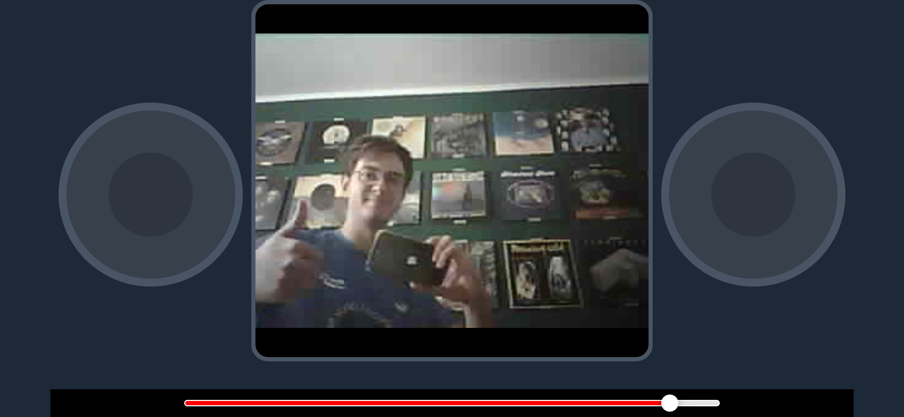
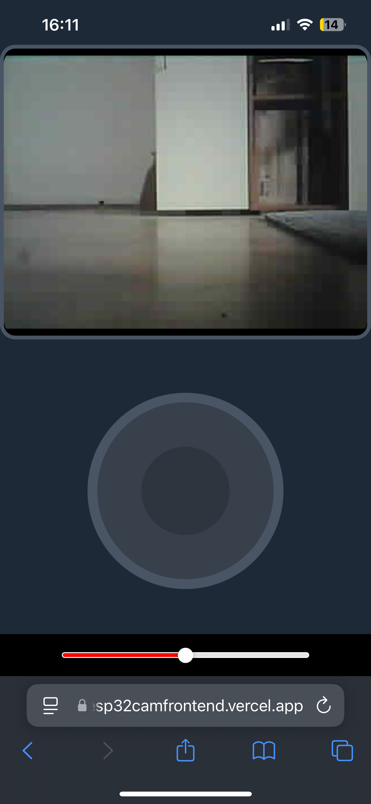
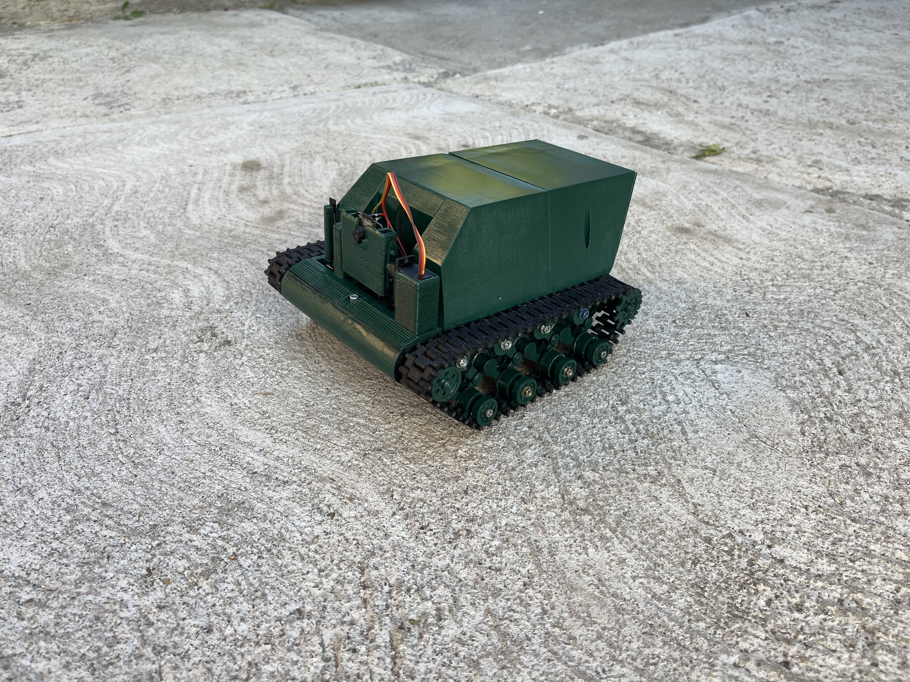

# ESP32-CAM Controlled 3D Printed Tank
## Short Description

A 3D printed tank controlled via ESP32-CAM and Arduino over the internet. The project is full-stack, with a NestJS (Node.js) backend, React (Vite) frontend, and real-time video streaming.
## Technologies

- Hardware: ESP32-CAM, Arduino, 3D printed tank

- Frontend: React, Vite

- Backend: Node.js, NestJS

- Other tools: Git, VS Code, Solidworks (3D modeling)
## Key Features

- Remote control via web browser

- Real-time video streaming from ESP32-CAM

- Forward, backward, and rotation movement, camera movement

- 3D modelling and printing of the tank

## Demo 

Frontend landscape mode



Frontend portrait mode



3D printed tank



## Installation Guide

 1. Clone the repository
```bash
git clone https://github.com/<your-username>/esp32-cam-tank.git
cd esp32-cam-tankk
```
2. Backend (NestJS + Node.js)
```bash
cd esp32cambackend
npm install
npm run start
```
3. Frontend (React + Vite)
```bash
cd esp32camfrontend
npm install
```
change the .env file: VITE_WS_SERVER=ws://[your ip address]:3000/client
```bash
npm run dev
```
4. ESP32 CAM
```bash
cd esp32camespandarduino/websocket
```
Open the websocket.ino file and change the ssidList and passList and the ws host
```bash
const char* ssidList[] = {[your ssid]};
const char* passList[] = {[your password]};
const char* ws_host = "[your backend server ip]";
```

Upload the code on the ESP32 CAM and Arduino Uno and enjoy!

## Tank assembly video:
[Tank assembly video](https://youtu.be/hCNDlij8ryc)

